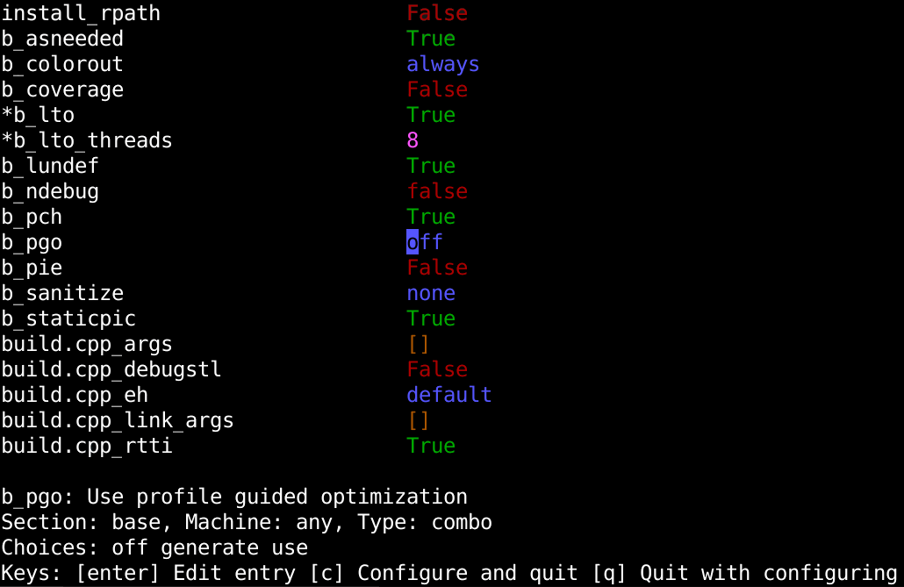

<!---
# SPDX-FileCopyrightText: 2022 Stephan Lachnit <stephanlachnit@debian.org>
# SPDX-License-Identifier: EUPL-1.2
--->

# mmeson

TUI to configure Meson projects similar to `ccmake` for CMake projects



## Installation

Install via pip:
```sh
pip install mmeson
```

## Running

```sh
python3 -m mmseon path/to/builddir
```

It is not need to run it in the project's source folder, however you need to setup the project beforehand.

Changed items will start with a star, press `enter` to edit a filed and enter to exit editing (except fields of type
boolean or combo). Press `c` to configure and exit and `q` to exit without configuring.

Note: you can always set options via `meson configure path/to/builddir -Doption=value` in addition to `mmeson`. This
does not reconfigure the project though, this needs to be done via `meson setup --reconfigure path/to/builddir`. When
exiting `mmeson` with `c`, it combines both of these steps, while exiting with `g` does not reconfigure the project.
Note that this will happen automatically though when you run `meson compile`.

## Dependencies

- Python3 >=3.11
- [`urwid`](https://github.com/urwid/urwid)

## ToDo-List

- Proper argparse configuration (w/ user-selectable meson binary)
- Testing / CI
- Code documentation
- Short user documentation

## License:

EUPL-1.2

## Notable mentions

- [`cmeson`](https://github.com/proskur1n/cmeson)
