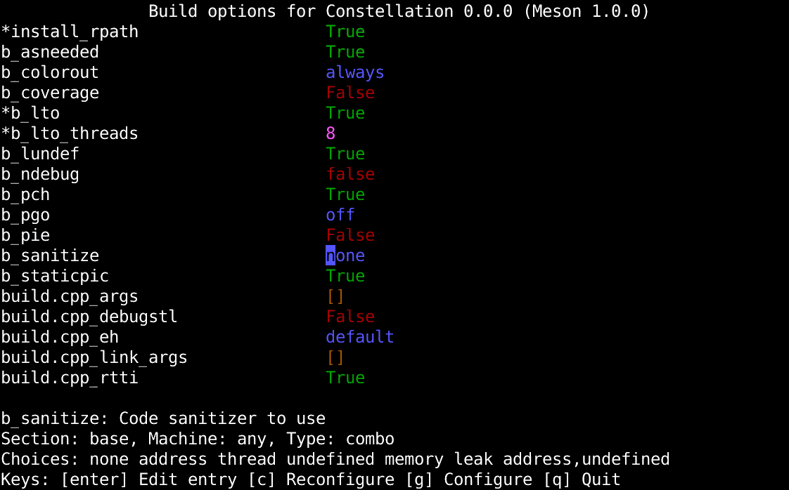

<!---
# SPDX-FileCopyrightText: 2022 Stephan Lachnit <stephanlachnit@debian.org>
# SPDX-License-Identifier: CC-BY-SA-4.0
--->

# mmeson

[](https://api.reuse.software/info/github.com/stephanlachnit/mmeson)
[](https://github.com/stephanlachnit/mmeson/actions/workflows/build_test.yml)

TUI to configure Meson projects similar to `ccmake` for CMake projects



## Installation

### Via pip

```sh
pip install mmeson
```

## Running

```sh
python3 -m mmseon path/to/builddir
```

It is not need to run it in the project's source folder, however you need to setup the project beforehand.

Changed items will start with a star, press `enter` to edit a filed and enter to exit editing (except fields of type
boolean or combo). Press `c` to configure and exit and `q` to exit without configuring.

Note: you can always set options via `meson configure path/to/builddir -Doption=value` in addition to `mmeson`. This
does not reconfigure the project though, this needs to be done via `meson setup --reconfigure path/to/builddir`. When
exiting `mmeson` with `c`, it combines both of these steps, while exiting with `g` does not reconfigure the project.
Note that this will happen automatically though when you run `meson compile`.

## Dependencies

- Python3 >=3.11
- [`urwid`](https://github.com/urwid/urwid)

## Contributing

Contributions are welcome, the code is well documented, especially the TUI part. You can find documentation of the
internal function and classes [here](https://stephanlachnit.github.io/mmeson/api/mmeson.html).

## ToDo-List

- Proper argparse configuration with user-selectable meson binary
- Unit tests and coverage report
- Extract dependencies in CI from pyproject.toml
- More elaborate error handling (e.g. array with choices)
- Check and return return-value of Meson commands
- Fix workaround for colored output
- Check feasibility of [`sphinx-argparse`](https://pypi.org/project/sphinx-argparse/)

## License

- Code: [EUPL-1.2](https://spdx.org/licenses/EUPL-1.2)
- Documentation: [CC-BY-SA-4.0](https://spdx.org/licenses/CC-BY-SA-4.0)

## Notable mentions

- [`cmeson`](https://github.com/proskur1n/cmeson)
